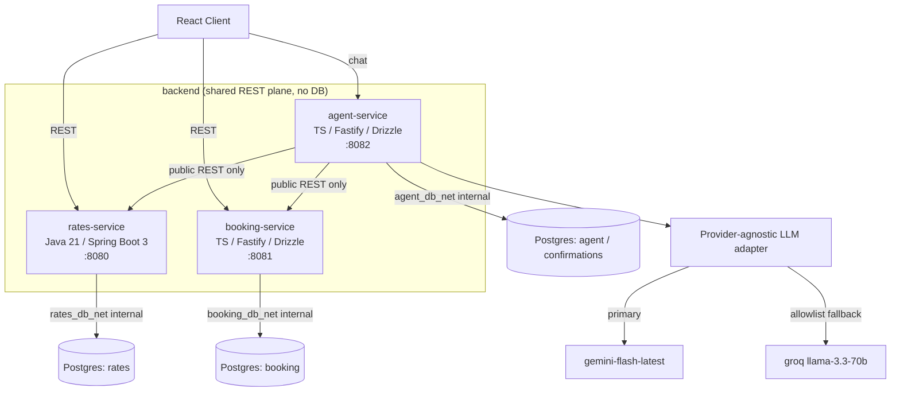

# FreightPilot

An agentic freight quoting and booking platform where an AI agent quotes and books shipments through the same public REST APIs a human uses. No privileged agent path, no back door, and no booking that executes without an explicit human click.

> **Demo:** _(coming soon: a GIF walkthrough and a live URL will land here)_

## What makes this interesting

### "LLM proposes, never executes": the confirmation gate

The agent produces an INERT proposal. It literally cannot call the booking endpoints, because the `create_booking` tool's execute function is not even handed an HTTP client (ADR-0008, the propose-only seam). The only thing that triggers real execution is a crypto-random 256-bit single-use token, bound to a server-authoritative proposal stored in agent-service's own database, and it is redeemed by an explicit user click on `POST /api/v1/confirmations/:token` (ADR-0009, the gate). This is enforced STRUCTURALLY, not by discipline: the executor (the only code that issues the two real booking calls) is unreachable from the LLM tool loop, and a static import-graph test asserts that unreachability so a future loop bug cannot open a path to execution.

### Process discipline

Contracts come first. The OpenAPI specs in `contracts/*.openapi.yaml` generate the typed clients, and CI regenerates them and runs `git diff --exit-code` so a committed client can never silently drift from its contract. Every real decision gets an ADR in `docs/decisions/`. Each service owns its own Postgres, enforced at the Docker network layer (each database sits on a per-service `internal: true` network the other services cannot route to). CI also runs a Spectral contract lint (with a ruleset self-test) and an oasdiff breaking-change check on every pull request.

### Provider-agnostic LLM layer at $0

The LLM layer is hand-rolled `fetch` with no vendor SDKs (ADR-0006), which keeps one normalizer and one error classifier over the raw HTTP bytes and shrinks the dependency and attack surface. An ordered fallback chain fails over ONLY on an allowlist (429, 5xx, timeout, network), so a genuine bug is never masked as a provider outage. Record/replay fixture tests exercise the whole adapter with ZERO live provider calls in CI. The live-verified chain is primary `gemini:gemini-flash-latest`, fallback `groq:llama-3.3-70b-versatile`; Cerebras was dropped when its free tier turned paywalled (ADR-0007). Target LLM spend is $0 via free tiers.

## Architecture

Four services, each with its own stack and its own Postgres.

| Service | Stack | Port | Owns |
|---|---|---|---|
| `services/rates` | Java 21, Spring Boot 3, Maven, Flyway | 8080 | Lanes, rate cards, surcharges, quote calculation (strategy per mode) |
| `services/booking` | TypeScript, Fastify, Drizzle | 8081 | Quote holds, the booking lifecycle state machine (single enforcement point, illegal transition is a typed 409), append-only event log, idempotency |
| `services/agent` | TypeScript, Fastify, Drizzle | 8082 | NL intake, the tool loop, the provider adapter, the confirmation gate (its DB currently holds the `confirmations` table; conversation history and telemetry are planned, not built) |
| `client` | React 18, Vite, TanStack Query | | Manual flow, quote breakdown, booking detail, event timeline |

Money is integer cents end to end. Cross-service data flows through REST contracts only; there are no shared tables and no cross-service hard foreign keys.

The Compose topology enforces database ownership by routing. There is a shared `backend` REST plane (no database is on it), plus `rates_db_net`, `booking_db_net`, and `agent_db_net`, each `internal: true` and attached ONLY to its owning service. agent-service is on `[backend, agent_db_net]`, so it reaches rates and booking over public REST on `backend` and can route to ONLY its own database, never theirs.



## The booking flow (where the gate is visible)

1. **Calculate quote.** Pure calculation in rates-service (no side effects).
2. **Persist the quote**, then **hold** it (quote goes ACTIVE to HELD).
3. **The agent PROPOSES `create_booking`.** This is an inert proposal; the gate mints a token and returns a confirmation card. Nothing has executed.
4. **The user clicks confirm**, which redeems the token.
5. **The gate executes TWO real calls** (ADR-0005): `POST /bookings` (the booking is born QUOTED then moves to HELD, idempotent on `token = Idempotency-Key`), then `POST /bookings/{id}/confirm` (HELD to CONFIRMED).

The user click is the only thing between a proposal and execution.

## Quickstart

Prerequisites: Docker (with Compose), Node 22 and pnpm 9, and JDK 21 with Maven for the rates service.

```bash
make up               # build + start, wait for healthchecks, print rates:8080 booking:8081 agent:8082
make seed             # load rates demo data (idempotent, safe to re-run)
make migrate-booking  # apply booking-service Drizzle migrations
make migrate-agent    # apply agent-service Drizzle migrations (the confirmations table)
make test             # run each service's test suite
make down             # stop and remove containers + volumes
```

The databases publish no host ports (ADR-0001): they sit on internal-only networks, so `make seed` and the migrations run inside the Compose network. Environment templates live at `./.env.example` (root) and `./services/agent/.env.example`.

## Project status

Honest and current. There is no live instance and no public URL yet.

- **Phase 1 is complete and CI-green:** rates-service, booking-service, and the client manual flow (search, quote, hold, book, confirm or cancel, with booking detail and an event timeline).
- **Phase 2 agent layers are merged:** L1 (the provider-agnostic LLM adapter), L2 (the tool loop with extraction and validation), and L3 (the confirmation gate and booking execution).
- **Outstanding:** the chat UI and confirmation cards (D14), the telemetry dashboard (D15), the 40-case eval suite (PLANNED, not built: `make evals` is a stub today), and the AWS deploy (Phase 3, not yet built).

### CI

Every push runs: `node-services` (lint, typecheck, test, build for booking and agent, plus an agent-scoped generated-client drift gate), `client` (plus its own drift gate), `client-e2e` (Playwright, hermetic against a mocked rates API; the live-stack booking E2E is deferred per ADR-0004), `rates-service` (`mvn verify` with Testcontainers), `booking-it` and `agent-it` (Testcontainers integration against real Postgres), and `contracts` (Spectral lint, a ruleset self-test, and an oasdiff breaking-change check). The eval suite is not wired into CI yet.

## Decision log

Decisions are recorded as ADRs under [`docs/decisions/`](docs/decisions/). The load-bearing ones:

- **[ADR-0005](docs/decisions/0005-booking-hold-level-model-option2-idempotency.md)**: booking hold-level model, born QUOTED and held on create, actor-agnostic confirm, first-write-wins idempotency.
- **[ADR-0006](docs/decisions/0006-llm-adapter-hand-rolled-fetch-no-sdk.md)**: hand-rolled LLM adapter, no SDKs, record/replay at the HTTP boundary.
- **[ADR-0008](docs/decisions/0008-propose-only-create-booking-seam.md)**: the propose-only `create_booking` seam.
- **[ADR-0009](docs/decisions/0009-agent-l3-confirmation-gate.md)**: the L3 confirmation gate.

The full plan lives in [`docs/MASTER_PLAN.md`](docs/MASTER_PLAN.md).
