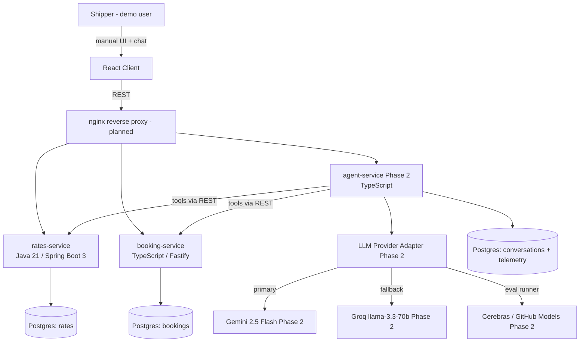

# FreightPilot

FreightPilot is a microservices freight quoting and booking platform built with Java 21 / Spring Boot 3, TypeScript / Fastify, and React 18. The design intent is that an AI agent will quote and book shipments through the exact same public REST APIs a human uses, with an explicit human-confirmation gate before any booking executes. Development is contract-first (OpenAPI specs land before implementation) and every change is CI-gated: per-service unit tests, real-Postgres integration tests via Testcontainers, a contract drift check, and a hermetic Playwright end-to-end test all run on every push. Money is integer cents end to end, and each service owns its own database.

Honest status: **Phase 1 (the manual product) is built and CI-green.** A user can search lanes, calculate a quote with a full surcharge breakdown, book from that quote, and confirm or cancel, ending on a booking-detail view with an append-only event timeline. **Phase 2 (the agent layer) is in progress and not yet built:** agent-service is a health-check skeleton today, so the LLM provider adapter, the tool loop, and the confirmation gate described below are the design target, not shipped code. There is no AWS deployment and no public URL yet.

## System context



Caption: the `client` + `rates-service` + `booking-service` path is built and CI-green. agent-service, the LLM layer, and the nginx proxy are the Phase 2 / roadmap target. Today the client calls rates-service and booking-service directly via `VITE_RATES_URL` (:8080) and `VITE_BOOKING_URL` (:8081); nginx is not wired into Compose yet.

## Architecture

| Service | Stack | Owns | Status |
|---|---|---|---|
| rates-service | Java 21, Spring Boot 3, Maven, Flyway, Postgres (:8080) | Lanes, rate cards, surcharges, quote calculation (strategy per mode) | Built, CI-green |
| booking-service | TypeScript, Fastify, Drizzle, Postgres (:8081) | Quote holds, booking lifecycle state machine, append-only event log, idempotency | Built, CI-green |
| agent-service | TypeScript, Fastify, Postgres (:8082) | NL intake, tool loop, provider adapter, confirmation gate, telemetry | Skeleton only (health check); Phase 2 |
| client | React 18, Vite, TanStack Query | Manual flow, quote breakdown, booking detail, event timeline | Built, CI-green (agent chat panel is Phase 2) |

Load-bearing rules (defended in ADRs, enforced in code):

- **Each service owns its own database.** Cross-service data flows through REST contracts only. There are no shared tables and no cross-service hard foreign keys (they are FK-by-convention). Compose puts each Postgres on its own internal-only network reachable solely by its owning service, so the boundary is enforced by routing, not trust.
- **The agent will consume the SAME public APIs as the UI** (design rule; agent not built). There is no privileged agent path. This keeps the audit trail (`actor=agent`) honest once the agent exists.
- **Booking transitions are enforced in exactly one place.** `services/booking/src/domain/stateMachine.ts` is the single enforcement point; an illegal transition is a typed 409. Mutating booking state outside it is impossible by construction.
- **Money is integer cents end to end.** No floating-point currency anywhere in the quote path.

Design decisions are recorded as ADRs under [`docs/decisions/`](docs/decisions/); the full plan lives in [`docs/MASTER_PLAN.md`](docs/MASTER_PLAN.md).

## Quick start

Requires Docker (with Compose), Node 22 + pnpm 9, and JDK 21 + Maven for the rates service.

```bash
make up               # build + start the stack, block until every healthcheck is green
                      # prints: rates:8080  booking:8081  agent:8082
make seed             # load rates demo data (idempotent, safe to re-run)
make migrate-booking  # apply booking-service Drizzle migrations
make test             # run each service's test suite
make down             # stop and remove containers + volumes
```

**No host ports on the databases (ADR-0001).** The three Postgres containers are on internal-only networks and publish no host ports. `make seed` runs `psql` inside the rates-db container, and `make migrate-booking` runs the Drizzle migrator inside the Compose network. To open a database yourself, exec into it:

```bash
docker compose exec rates-db psql -U rates -d rates
docker compose exec booking-db psql -U booking -d booking
```

Per-service commands (verified against each `package.json` / `pom.xml`):

```bash
# rates-service (services/rates): unit + Testcontainers integration tests
mvn -B verify

# booking-service (services/booking)
pnpm test               # Vitest unit tests (state machine, etc.)
pnpm test:integration   # Testcontainers integration tests against real Postgres
pnpm lint
pnpm typecheck

# client (client)
pnpm test               # Vitest
pnpm e2e                # hermetic Playwright end-to-end (rates/booking mocked at network layer)
pnpm typecheck
pnpm lint
```

`make evals` is currently a stub that prints "no eval cases yet"; the eval suite is Phase 3 (see roadmap).

## Engineering decisions

- [`0001-db-internal-networks-no-host-ports.md`](docs/decisions/0001-db-internal-networks-no-host-ports.md). Each Postgres runs on an internal-only network with no host ports; reach it via `docker compose exec`, which enforces the database-ownership boundary by routing.
- [`0002-seed-standalone-not-flyway-migration.md`](docs/decisions/0002-seed-standalone-not-flyway-migration.md). The demo seed is a standalone idempotent SQL script (fixed UUIDs + `ON CONFLICT`), kept out of the schema migration history so migrations stay pure DDL.
- [`0003-surcharge-composition-percent-of-base.md`](docs/decisions/0003-surcharge-composition-percent-of-base.md). Surcharges are percent-of-base, rounded per line, and sum exactly to the total, so the client never re-sums money.
- [`0004-l4-split-rates-half-now-booking-half-deferred.md`](docs/decisions/0004-l4-split-rates-half-now-booking-half-deferred.md). L4 was split so the rates UI could ship before booking-service existed; the booking half was deferred, then discharged, without ever inventing a fake API (contract-first). A 2026-07-20 addendum records that the L4 gate is ready for external review but still open.
- [`0005-booking-hold-level-model-option2-idempotency.md`](docs/decisions/0005-booking-hold-level-model-option2-idempotency.md). A booking is born `QUOTED` and held on create; confirm is actor-agnostic; idempotency is first-write-wins.

## Technical highlights

Each of these maps to real code in the repo.

**Contract drift gate.** The `contracts` CI job (`.github/workflows/ci.yml`) runs Spectral lint on every OpenAPI spec, a ruleset self-test, and `oasdiff breaking --fail-on ERR` against the PR base branch. The client job separately regenerates the TypeScript API client with `pnpm gen:api` and fails via `git diff --exit-code src/api` if the generated client drifted from the committed contract. Contracts and the code that consumes them cannot silently diverge.

**Exhaustive state-machine transition matrix.** `services/booking/src/domain/stateMachine.ts` holds the single allowed-transition table and is pure (no DB), so every legal and illegal transition is unit-testable without a container. An illegal transition throws a typed error surfaced as HTTP 409.

| From | Allowed to |
|---|---|
| (birth: null) | QUOTED |
| QUOTED | HELD, CANCELLED, EXPIRED |
| HELD | CONFIRMED, CANCELLED, EXPIRED |
| CONFIRMED | DOCUMENTS_ISSUED, CANCELLED |
| DOCUMENTS_ISSUED | (terminal) |
| EXPIRED | (terminal) |
| CANCELLED | (terminal) |

**Race-safe idempotency proven with Testcontainers.** `services/booking/test/idempotency.it.test.ts` runs against a real Postgres and proves first-write-wins under concurrent creates with the same idempotency key (ADR-0005), so double-clicks and retries cannot double-book.

**BigDecimal precision-DoS fix.** `services/rates/src/main/java/com/freightpilot/rates/web/dto/CargoDto.java` uses `@Digits` to bound the precision and scale of the decimal cargo fields. Without it, a short JSON literal with a huge exponent (for example `1E1000000000`) parses to a BigDecimal whose later `setScale` would allocate gigabytes, an unauthenticated single-request denial of service.

## Non-goals

Scope is deliberately fenced (MASTER_PLAN §1):

- No real carrier integrations; rate data is synthetic seed data modeled on real freight structure.
- No real auth (a single demo user), no payments.
- No Kubernetes; Docker Compose locally and the simplest viable AWS deploy.
- No reinforcement learning and no fine-tuning; the agent is tool-calling plus prompts plus evals.
- Desktop-first React; no mobile.
- Temporal, SQS, and an MCP server are Phase 4 stretch only.

## Roadmap

- **Phase 1 (L1-L4, the manual product): built and CI-green.** Rates and booking, backend to browser. The first AWS deploy (D9) and the external L4 review gate are still ahead, so nothing is deployed and there is no live URL yet.
- **Phase 2 (L5, the agent layer): in progress, next up.** Provider adapter with automatic fallback routing, tool schemas mapped one-to-one onto the public endpoints, extraction with validation and retry, the confirmation gate, and per-request telemetry.
- **Phase 3 (L6-L7): planned.** The 40-case eval suite as a merge-blocking CI gate, the telemetry dashboard, then ops and AWS deployment.

See [`docs/MASTER_PLAN.md`](docs/MASTER_PLAN.md) for the full plan.
