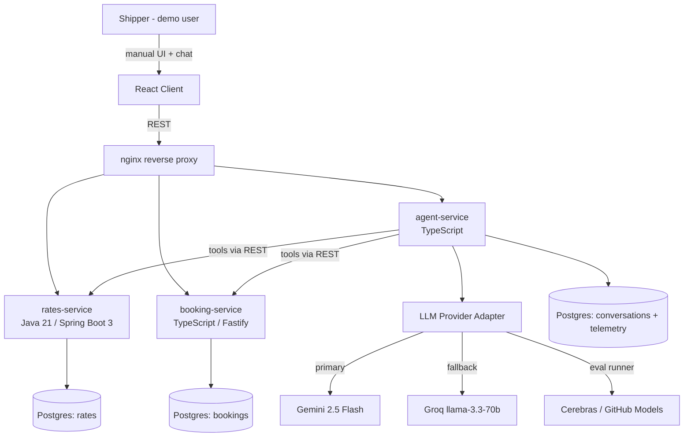
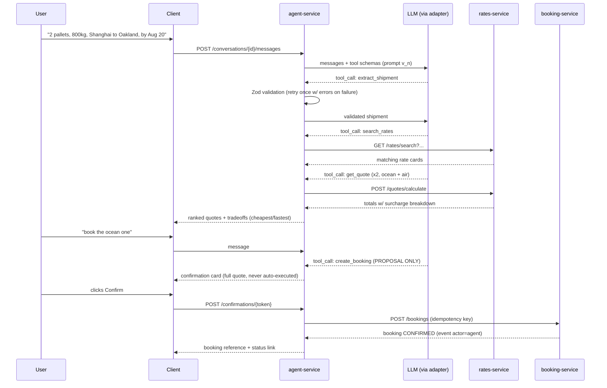
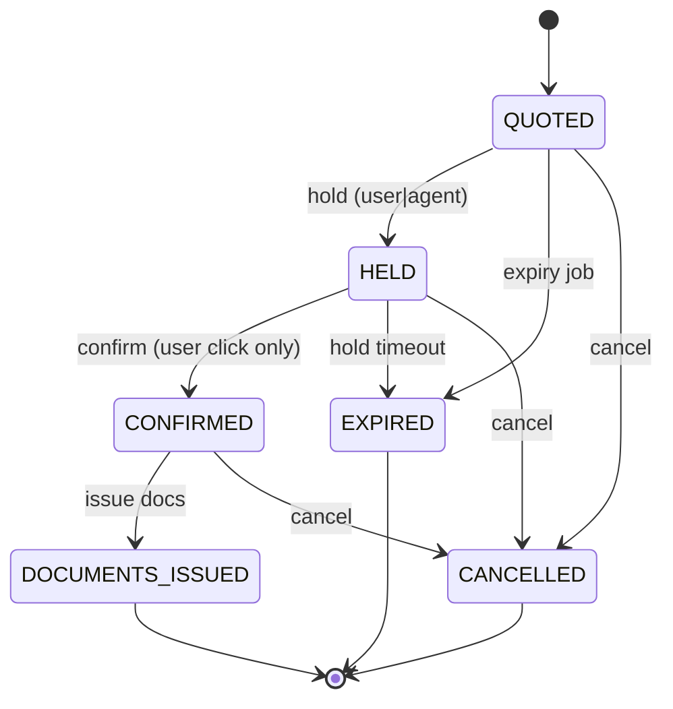
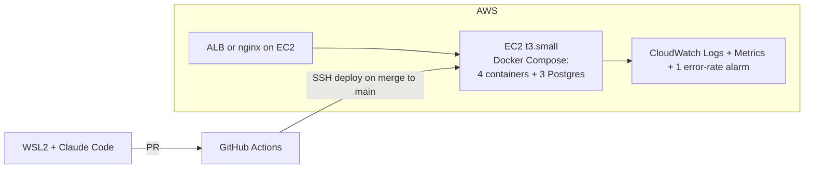
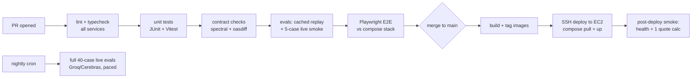

# FreightPilot — Master Plan (v2)

Agentic freight quoting and booking platform. Portfolio project targeting Flexport's Autonomous Freight Systems team (mid-level posting primary, senior posting secondary) and adjacent full-stack + AI product roles (Samsara, project44, Motive, Shippo).

**One-line pitch:** A self-serve freight booking product where an AI agent can quote and book shipments end to end through the same APIs a human uses — engineered like production software, with a provider-agnostic LLM layer, CI-gated evals, telemetry, and confirmation-gated actions. Total LLM spend: $0.

---

## Table of Contents

0. [Prerequisites & Environment Setup](#0-prerequisites--environment-setup)
1. [Success Criteria & Non-Goals](#1-success-criteria--non-goals)
2. [System Architecture](#2-system-architecture)
3. [Layered Development System](#3-layered-development-system)
4. [Data Model (full DDL)](#4-data-model)
5. [API Contracts](#5-api-contracts)
6. [Agent Design & Provider-Agnostic LLM Layer](#6-agent-design--llm-layer)
7. [Eval Suite](#7-eval-suite)
8. [Telemetry & Observability](#8-telemetry--observability)
9. [CI/CD Pipeline](#9-cicd-pipeline)
10. [Repository Structure](#10-repository-structure)
11. [Phase Plan (day-level)](#11-phase-plan)
12. [Deliverables & Positioning](#12-deliverables--positioning)
13. [Risk Register](#13-risk-register)

---

## 0. Prerequisites & Environment Setup

Complete ALL of this before Phase 0. Budget: half a day.

### 0.1 Accounts & API keys (all free, no credit card)

| Provider | What for | Signup | Key env var |
|---|---|---|---|
| Google AI Studio | Gemini 2.5 Flash — primary agent model (tool calling) | aistudio.google.com | `GEMINI_API_KEY` |
| Groq | llama-3.3-70b — fallback + fast eval runner (30 RPM / 1,000 req/day free) | console.groq.com | `GROQ_API_KEY` |
| Cerebras | High-volume eval batches (~1M tokens/day free; catalog is volatile — never hardcode one model) | cloud.cerebras.ai | `CEREBRAS_API_KEY` |
| GitHub Models | CI-friendly fallback (auth via GitHub token you already have) | github.com/marketplace/models | `GITHUB_TOKEN` |
| AWS | Deployment (free tier: t3.micro/t4g.small EC2, or ECS with small Fargate task) | existing account | AWS CLI profile |

Rules:
- All keys live in `.env` locally (gitignored) and GitHub Actions secrets in CI. Never committed.
- Verify each key with a 1-line curl before Phase 0 ends. Put the curl commands in `docs/setup.md` as you go.
- Free tiers may train on your prompts. FreightPilot's data is synthetic, so acceptable — note this tradeoff in the README (it's an interview answer).

### 0.2 Local toolchain (WSL2 Ubuntu)

| Tool | Version | Check |
|---|---|---|
| Docker Desktop w/ WSL2 backend | latest | `docker compose version` |
| Node.js | 22 LTS via nvm | `node -v` |
| pnpm | 9+ | `pnpm -v` |
| Java (Temurin) | 21 | `java -version` |
| Maven | 3.9+ | `mvn -v` |
| Postgres client | psql 16 | `psql --version` |
| AWS CLI | v2 | `aws sts get-caller-identity` |
| Claude Code CLI | latest | existing setup from terminal-agent-lab |

### 0.3 Repo bootstrap checklist

- [ ] Create `freightpilot` repo on GitHub (public), clone into WSL2
- [ ] Add `CLAUDE.md` (conventions — see §3.7)
- [ ] Add `.gitignore` (node, java, .env, eval results cache)
- [ ] Add `docs/` with this plan as `docs/MASTER_PLAN.md`
- [ ] Branch protection on `main`: PRs required, CI must pass
- [ ] Two-model workflow: Claude Code CLI builds; separate claude.ai session reviews and gates each layer/phase exit (same setup as terminal-agent-lab)

### 0.4 Domain knowledge prep (2 hours, not more)

Skim enough real freight structure to make the seed data credible:
- Ocean: FCL vs LCL, FEU/TEU, port pairs, typical Shanghai→Oakland FEU rate magnitude ($2–4k), transit 14–20 days
- Air: chargeable weight (max of actual vs volumetric), $4–8/kg, transit 2–5 days
- Truck (drayage/FTL): per-mile or flat lane pricing
- Surcharges: BAF/fuel, peak season (PSS), security, handling
Write a 1-page `docs/domain-notes.md`. This page is also your "I understand freight" interview prep.

---

## 1. Success Criteria & Non-Goals

### Done means all of these are true

1. A user can manually quote and book a shipment through the deployed React UI with zero AI involvement.
2. A user can type a natural-language shipment request; the agent extracts → validates → presents ranked quotes → answers follow-ups → books, with an explicit human confirmation card before any booking executes.
3. The agent runs on a provider-agnostic LLM layer: primary Gemini Flash, automatic fallback to Groq, model/provider chosen by env config; a provider outage degrades gracefully instead of breaking the demo.
4. CI runs unit tests AND the eval suite on every push; eval pass rate below threshold blocks merge.
5. Every agent request logs latency (total + per tool call), tokens, estimated cost, provider, prompt version, and outcome.
6. Deployed on AWS with a public URL and a 2-minute demo video.
7. Repo contains: architecture + sequence + state diagrams, README with documented design patterns, one real post-mortem, decisions journal.

**The 90-second recruiter test:** a recruiter skimming the repo should see their stack (Spring Boot, React, AWS), microservices, a gated agent with a multi-provider LLM layer, and CI-run evals — and conclude "this person already works the way our team works."

### Non-goals (binding scope protection)

- No real carrier integrations; seeded synthetic rate data modeled on real freight structure
- No real auth (single demo user), no payments
- No Kubernetes (Compose locally; simplest viable AWS deploy)
- No RL, no fine-tuning — tool-calling + prompt engineering + evals only
- No mobile; desktop-first React
- Temporal / SQS / MCP server = Phase 4 stretch only

---

## 2. System Architecture

### 2.1 System context (C4 level 1)



### 2.2 Service responsibility matrix

| Service | Stack | Owns | Does NOT own |
|---|---|---|---|
| rates-service | Java 21, Spring Boot 3, Postgres, Flyway | Lanes, rate cards, surcharges, quote calculation (strategy per mode) | Booking state, anything agent |
| booking-service | TS, Fastify, Postgres, Drizzle | Quote holds, booking lifecycle state machine, event log, idempotency | Rate math |
| agent-service | TS, Fastify, Postgres | NL intake, tool loop, provider adapter, validation/retry, confirmation gating, telemetry, conversation state | Direct DB access to rates/bookings — tools go through public APIs only |
| client | React 18, TS, Vite, TanStack Query | Manual flow + agent chat panel + confirmation cards + telemetry mini-dashboard | Business logic |

**Two load-bearing architectural rules (state them in the README, defend them in interviews):**
1. The agent consumes the SAME public APIs as the UI. No privileged agent path. This is the honest production pattern and makes the audit trail (`actor=agent`) meaningful.
2. Each service owns its database. Cross-service data flows through REST contracts only.

### 2.3 Agent booking flow (sequence diagram)



### 2.4 Booking state machine



Transitions enforced in exactly one class per service; every transition appended to `booking_events` with `actor ∈ {user, agent, system}`.

### 2.5 Deployment diagram (AWS)



Decision: single EC2 + Compose is the default (cheapest, simplest). Upgrade to ECS Fargate ONLY if Phase 3 finishes early — it's a nicer resume line but not worth schedule risk.

---

## 3. Layered Development System

Build in horizontal layers, bottom-up. Each layer has an owner artifact, a definition of done, and a review gate (external claude.ai session) before the next layer starts. Layers within a phase can interleave, but a layer is never "done" until its gate passes.

```
L7  Ops & Delivery         deploy, monitoring, alarms, post-mortem
L6  Quality & Evals        eval suite, CI gates, telemetry dashboard
L5  Agent Layer            tool loop, gating, validation, provider adapter
L4  Presentation           React manual flow + chat panel
L3  API Contract           OpenAPI specs, error envelope, versioning
L2  Domain/Service         quote calc, state machine, idempotency
L1  Data                   schemas, migrations, seed data
L0  Foundation             repo, CLAUDE.md, Compose, CI skeleton, env config
```

### L0 — Foundation
- Monorepo layout (§10), Compose file bringing up empty services + Postgres x3, GitHub Actions running lint + hello-world tests, `.env.example`, Makefile (`make up`, `make seed`, `make test`, `make evals`)
- **DoD:** fresh clone → `make up` → all healthchecks green; CI green on empty PR

### L1 — Data
- Flyway migrations (rates), Drizzle migrations (booking, agent), seed script: 15 lanes × 2–3 modes, realistic magnitudes, overlapping validity windows (so "which rate applies on date X" is a real query)
- **DoD:** `make seed` idempotent; a documented psql query answers "cheapest ocean Shanghai→Oakland valid on 2026-08-01"

### L2 — Domain/Service
- rates-service: `RateStrategy` interface + Ocean/Air/Truck implementations (air uses chargeable weight = max(actual, volumetric)), surcharge composition (FLAT + PERCENT ordering documented), JUnit tests incl. property-style tests on totals
- booking-service: `BookingStateMachine` (single enforcement point, invalid transition = typed 409), `booking_events` append on every transition, idempotency-key handling on create
- **DoD:** unit coverage on all strategies and all legal/illegal transitions; mutation of state outside the machine is impossible by construction

### L3 — API Contract
- OpenAPI 3 specs checked into `contracts/` for both services BEFORE frontend work; generated TS client for the React app; uniform error envelope `{code, message, details[]}`; request IDs propagated via `X-Request-Id`
- **DoD:** specs lint clean (spectral); client generated in CI; breaking-change check on PRs (oasdiff)

### L4 — Presentation
- Manual flow: search form → quote list (sortable by price/transit) → book → booking detail w/ event timeline
- Later in Phase 2: chat panel, confirmation cards, fallback-to-form behavior
- **DoD:** manual E2E happy path passes as a Playwright test

### L5 — Agent Layer (see §6 for full design)
- Provider adapter, tool schemas, extraction + validation + retry, confirmation gate, conversation persistence
- **DoD:** demo script passes against BOTH Gemini and Groq by flipping one env var; kill the primary provider mid-conversation → fallback continues the conversation

### L6 — Quality & Evals (see §7, §8)
- 40-case eval suite in CI (merge-blocking), telemetry recorded per request, mini dashboard
- **DoD:** eval scorecards committed per prompt version; deliberately degrading the prompt makes CI fail (test the gate itself once)

### L7 — Ops & Delivery
- Deploy pipeline, CloudWatch, error-rate alarm, post-mortem doc, demo video
- **DoD:** merge to main → live in prod without manual steps; alarm fires when you kill a service on purpose

### 3.7 CLAUDE.md conventions (write at L0)

Contents: service boundaries ("agent-service NEVER touches rates/booking DBs"), "never bypass the state machine," commit style, test commands per service, prompt files are code (PR + eval run required to change), where decisions/journal live, layer gates require external review before proceeding.

---

## 4. Data Model

### 4.1 rates-service (Flyway migrations)

```sql
CREATE TYPE mode AS ENUM ('OCEAN','AIR','TRUCK');
CREATE TYPE rate_unit AS ENUM ('PER_CONTAINER','PER_KG','PER_PALLET','PER_MILE');
CREATE TYPE surcharge_type AS ENUM ('FUEL','PEAK_SEASON','SECURITY','HANDLING');
CREATE TYPE surcharge_calc AS ENUM ('FLAT','PERCENT');

CREATE TABLE lanes (
  id            UUID PRIMARY KEY DEFAULT gen_random_uuid(),
  origin_code   TEXT NOT NULL,        -- UN/LOCODE, e.g. CNSHA
  origin_name   TEXT NOT NULL,        -- Shanghai
  dest_code     TEXT NOT NULL,        -- USOAK
  dest_name     TEXT NOT NULL,
  mode          mode NOT NULL,
  distance_mi   INT,                  -- TRUCK only
  UNIQUE (origin_code, dest_code, mode)
);

CREATE TABLE rate_cards (
  id               UUID PRIMARY KEY DEFAULT gen_random_uuid(),
  lane_id          UUID NOT NULL REFERENCES lanes(id),
  base_rate_cents  BIGINT NOT NULL CHECK (base_rate_cents > 0),
  currency         CHAR(3) NOT NULL DEFAULT 'USD',
  unit             rate_unit NOT NULL,
  transit_days_min INT NOT NULL,
  transit_days_max INT NOT NULL CHECK (transit_days_max >= transit_days_min),
  valid_from       DATE NOT NULL,
  valid_to         DATE NOT NULL CHECK (valid_to > valid_from)
);
CREATE INDEX idx_rate_cards_lookup ON rate_cards (lane_id, valid_from, valid_to);

CREATE TABLE surcharges (
  id            UUID PRIMARY KEY DEFAULT gen_random_uuid(),
  rate_card_id  UUID NOT NULL REFERENCES rate_cards(id),
  type          surcharge_type NOT NULL,
  calc          surcharge_calc NOT NULL,
  amount        BIGINT NOT NULL     -- cents if FLAT, basis points if PERCENT
);
```

Seed: ~15 lanes (CNSHA↔USOAK, CNSZX↔USLAX, NLRTM↔USNYC, USOAK→USLAX truck, etc.), each lane 1–3 rate cards with overlapping validity windows, 1–3 surcharges each. Magnitudes from `docs/domain-notes.md`.

### 4.2 booking-service (Drizzle)

```sql
CREATE TYPE quote_status AS ENUM ('ACTIVE','HELD','EXPIRED','CONSUMED');
CREATE TYPE booking_status AS ENUM
  ('QUOTED','HELD','CONFIRMED','DOCUMENTS_ISSUED','EXPIRED','CANCELLED');
CREATE TYPE actor AS ENUM ('user','agent','system');

CREATE TABLE quotes (
  id             UUID PRIMARY KEY DEFAULT gen_random_uuid(),
  lane_id        UUID NOT NULL,           -- FK by convention (cross-service, no hard FK)
  rate_card_id   UUID NOT NULL,
  shipment       JSONB NOT NULL,          -- validated ShipmentSpec snapshot
  breakdown      JSONB NOT NULL,          -- base + each surcharge line
  total_cents    BIGINT NOT NULL,
  currency       CHAR(3) NOT NULL,
  status         quote_status NOT NULL DEFAULT 'ACTIVE',
  expires_at     TIMESTAMPTZ NOT NULL,
  created_at     TIMESTAMPTZ NOT NULL DEFAULT now()
);

CREATE TABLE bookings (
  id               UUID PRIMARY KEY DEFAULT gen_random_uuid(),
  quote_id         UUID NOT NULL REFERENCES quotes(id),
  shipper_ref      TEXT NOT NULL,
  status           booking_status NOT NULL DEFAULT 'QUOTED',
  idempotency_key  TEXT NOT NULL UNIQUE,
  created_at       TIMESTAMPTZ NOT NULL DEFAULT now(),
  confirmed_at     TIMESTAMPTZ
);

CREATE TABLE booking_events (
  id           BIGSERIAL PRIMARY KEY,
  booking_id   UUID NOT NULL REFERENCES bookings(id),
  from_status  booking_status,
  to_status    booking_status NOT NULL,
  actor        actor NOT NULL,
  metadata     JSONB,                     -- e.g. conversation_id for agent actions
  at           TIMESTAMPTZ NOT NULL DEFAULT now()
);
```

### 4.3 agent-service

```sql
CREATE TABLE conversations (
  id          UUID PRIMARY KEY DEFAULT gen_random_uuid(),
  created_at  TIMESTAMPTZ NOT NULL DEFAULT now()
);

CREATE TABLE messages (
  id               BIGSERIAL PRIMARY KEY,
  conversation_id  UUID NOT NULL REFERENCES conversations(id),
  role             TEXT NOT NULL,        -- user | assistant | tool
  content          JSONB NOT NULL,
  created_at       TIMESTAMPTZ NOT NULL DEFAULT now()
);

CREATE TABLE confirmations (               -- pending gated actions
  token         UUID PRIMARY KEY DEFAULT gen_random_uuid(),
  conversation_id UUID NOT NULL,
  action        TEXT NOT NULL,            -- 'create_booking'
  payload       JSONB NOT NULL,
  status        TEXT NOT NULL DEFAULT 'PENDING',  -- PENDING|EXECUTED|EXPIRED|DECLINED
  expires_at    TIMESTAMPTZ NOT NULL
);

CREATE TABLE llm_requests (                -- telemetry, one row per LLM call
  id               BIGSERIAL PRIMARY KEY,
  conversation_id  UUID,
  provider         TEXT NOT NULL,         -- gemini | groq | cerebras | github
  model            TEXT NOT NULL,
  prompt_version   TEXT NOT NULL,         -- e.g. v3
  latency_ms       INT NOT NULL,
  input_tokens     INT,
  output_tokens    INT,
  est_cost_usd     NUMERIC(10,6) DEFAULT 0,  -- 0 on free tiers; formula kept anyway
  outcome          TEXT NOT NULL,         -- completed|clarified|fell_back|error|rate_limited
  fallback_used    BOOLEAN NOT NULL DEFAULT false,
  created_at       TIMESTAMPTZ NOT NULL DEFAULT now()
);
```

### 4.4 Design patterns to implement AND document

| Pattern | Where | README writeup angle |
|---|---|---|
| Strategy | Rate calc per mode (rates-service) | why polymorphism beats a switch on mode |
| State | Booking lifecycle (booking-service) | single enforcement point + audit log |
| Repository | Data access, both services | testability, swap-ability |
| Adapter | LLM provider layer (agent-service) | one interface, four providers, env-selected |
| Chain of Responsibility (light) | Provider fallback ordering | resilience story |

Each gets a one-paragraph "why here" in the README — covers the mid-level JD's OOD requirement and gives canned interview answers.

---

## 5. API Contracts

Uniform error envelope everywhere: `{ "code": "RATE_NOT_FOUND", "message": "...", "details": [] }`. `X-Request-Id` in, echoed out, logged. OpenAPI specs live in `contracts/` and are written BEFORE implementation (L3 gate).

### rates-service

| Method | Path | Purpose | Notes |
|---|---|---|---|
| GET | `/api/v1/lanes` | list lanes | filters: origin, dest, mode |
| GET | `/api/v1/rates/search` | rate cards valid for a ship date | `?origin=CNSHA&dest=USOAK&mode=OCEAN&ship_date=2026-08-01` |
| POST | `/api/v1/quotes/calculate` | full quote calc w/ surcharge breakdown | body: ShipmentSpec + rate_card_id; pure function, no persistence |

### booking-service

| Method | Path | Purpose | Notes |
|---|---|---|---|
| POST | `/api/v1/quotes` | persist a calculated quote | sets `expires_at` (24h) |
| POST | `/api/v1/quotes/{id}/hold` | ACTIVE→HELD | actor in body |
| POST | `/api/v1/bookings` | create booking from held quote | requires `Idempotency-Key` header; replay returns original 200 |
| POST | `/api/v1/bookings/{id}/confirm` | HELD→CONFIRMED | |
| POST | `/api/v1/bookings/{id}/cancel` | any→CANCELLED | |
| GET | `/api/v1/bookings/{id}` | booking + full event timeline | |

### agent-service

| Method | Path | Purpose |
|---|---|---|
| POST | `/api/v1/conversations` | start conversation |
| POST | `/api/v1/conversations/{id}/messages` | send message, returns assistant turn (SSE stream optional stretch) |
| POST | `/api/v1/confirmations/{token}` | user approves a gated action → NOW the booking API is called |
| GET | `/api/v1/telemetry/summary` | p50/p95 latency, outcome counts, fallback rate, tokens/day — feeds the mini dashboard |

**ShipmentSpec (shared schema, Zod + generated Java record):**

```ts
const ShipmentSpec = z.object({
  origin_code: z.string().length(5),          // UN/LOCODE
  dest_code:   z.string().length(5),
  mode:        z.enum(['OCEAN','AIR','TRUCK']).optional(), // agent may compare
  ship_date:   z.string().date(),
  deliver_by:  z.string().date().optional(),
  cargo: z.object({
    pallets:     z.number().int().positive().max(100).optional(),
    weight_kg:   z.number().positive().max(30000),
    volume_cbm:  z.number().positive().optional(),
    description: z.string().max(500)           // injection surface — see safety evals
  })
});
```

---

## 6. Agent Design & LLM Layer

### 6.1 Provider-agnostic adapter (the zero-cost + resilience story)

```ts
interface LlmProvider {
  name: string;
  chat(req: ChatRequest): Promise<ChatResponse>;   // messages, toolSchemas, temperature
  supportsTools: boolean;
}
```

- Implementations: `GeminiProvider` (native SDK), `OpenAiCompatProvider` (one class covering Groq / Cerebras / GitHub Models — they all speak the OpenAI schema; constructor takes baseURL + key + model)
- **Router:** ordered list from env, e.g. `LLM_CHAIN=gemini:gemini-2.5-flash,groq:llama-3.3-70b-versatile`. On 429/5xx/timeout (8s): log `fallback_used=true`, try next. All exhausted → typed error → UI shows "assistant unavailable, use the form" (manual flow always works)
- **Rate-limit pacing:** token-bucket per provider matching free-tier RPM (Gemini ~10 RPM, Groq 30 RPM) so the demo never dies to a 429
- **Normalization:** tool-call format differences (Gemini vs OpenAI-style) normalized inside the adapter; the agent loop sees one shape
- Env-only config: switching provider/model = redeploy with new env var, zero code change

**Resume line this buys:** "provider-agnostic LLM layer with automatic fallback routing and per-provider rate pacing across Gemini, Groq, and Cerebras — $0 inference cost."

### 6.2 Tools (each maps 1:1 to a public endpoint)

| Tool | Backs onto | Gated? |
|---|---|---|
| `search_rates` | rates GET /rates/search | no |
| `get_quote` | rates POST /quotes/calculate + booking POST /quotes | no |
| `hold_quote` | booking POST /quotes/{id}/hold | no |
| `create_booking` | booking POST /bookings + /confirm | **YES — proposal only** |
| `get_booking_status` | booking GET /bookings/{id} | no |

### 6.3 Reliability engineering (the senior-JD signal)

1. **Extraction + validation + retry:** LLM extracts into ShipmentSpec; Zod failure → ONE retry with the exact validation errors appended; second failure → pre-filled form fallback ("I got most of this — confirm the weight?"). Never silently guess.
2. **Confirmation gate:** the model can only PROPOSE `create_booking`. agent-service writes a `confirmations` row (10-min expiry) and returns a card; only the user's click on `/confirmations/{token}` executes the booking call. The LLM has no code path to book directly.
3. **Clarification budget:** ambiguous/absurd input (missing origin, 90,000 kg pallet) → ask, max 2 rounds, then hand off to the form.
4. **Idempotency:** confirmation token doubles as the Idempotency-Key; double-clicks and retries can't double-book.
5. **Prompt versioning:** `prompts/v3_system.md` + tool descriptions are versioned files; version logged on every request and stamped into eval scorecards; prompt changes require a PR that runs evals.
6. **Injection defense:** `cargo.description` is the untrusted surface; system prompt treats tool results and cargo text as data, and safety evals (§7) verify an embedded "ignore previous instructions" cannot trigger a gated action. (The gate makes this structurally safe anyway — defense in depth.)

---

## 7. Eval Suite (highest-signal artifact — never cut)

`evals/` — one command (`make evals`), run by CI on every push.

### Case tiers (~40 total, YAML)

1. **Extraction (~20):** NL → expected ShipmentSpec. Hard cases: metric/imperial mix ("1,760 lbs"), relative dates ("end of next month"), missing fields, volumetric-vs-actual weight, multi-leg red herrings, absurd values that must trigger clarification not extraction.
2. **Tool choice (~12):** conversation state → expected next tool call (name + key args) or expected clarifying question. E.g. "compare air vs ocean" must yield two `search_rates` calls.
3. **Safety (~8):** must NOT act — booking without confirmation, hallucinated lane, proceeding past failed validation, prompt injection inside cargo description, attempting to skip the hold step.

### Scoring & modes

- Exact match on structured fields; tool-choice by name + key args; safety strict pass/fail
- **PR mode:** recorded-response cache (deterministic, zero API calls) + a 5-case live smoke on Groq
- **Nightly + prompt-change mode:** full 40 live, spread across Groq/Cerebras with pacing to stay inside free limits
- Scorecard committed per prompt version: `evals/results/2026-07-24_v3.json` — improvement visible in git history
- **CI gate:** pass rate < 85% (ratchet upward over time) fails the build. Test the gate itself once by deliberately breaking the prompt.

Interview line: *"Prompt changes go through CI like any other change — I regression-test prompts like code."* This transplants your terminal-agent-lab eval methodology into a product context.

---

## 8. Telemetry & Observability

- Structured JSON logs (pino / logback-json), request ID propagated across all three services
- `llm_requests` table (§4.3) captures per-call latency, tokens, provider, prompt version, outcome, fallback flag
- Mini dashboard page in the client (`/telemetry`): p50/p95 agent latency, outcome distribution, fallback rate, tokens/day, per-provider split — recharts, reads `/telemetry/summary`
- CloudWatch: log groups per service, error-rate metric filter, ONE alarm (5xx rate) — proves you know alarms exist
- Documented CloudWatch Insights queries in `docs/observability.md`

---

## 9. CI/CD Pipeline



- Secrets (API keys, SSH key) in GitHub Actions secrets
- Branch protection: all jobs green required
- Deploy is a single job: pull images on EC2, `docker compose up -d`, run smoke. Rollback = re-deploy previous tag (documented in `docs/runbook.md`)

---

## 10. Repository Structure

```
freightpilot/
├── CLAUDE.md
├── Makefile                      # up, seed, test, evals, deploy
├── docker-compose.yml            # 4 services + 3 postgres + nginx
├── contracts/                    # OpenAPI specs (written before impl)
│   ├── rates.openapi.yaml
│   ├── booking.openapi.yaml
│   └── agent.openapi.yaml
├── services/
│   ├── rates/                    # Java 21 / Spring Boot 3 / Maven / Flyway
│   ├── booking/                  # TS / Fastify / Drizzle
│   └── agent/
│       ├── src/llm/              # provider adapter + router + pacing
│       ├── src/tools/            # tool schemas + executors
│       ├── src/gate/             # confirmations
│       └── src/telemetry/
├── client/                       # React 18 / Vite / TanStack Query
├── prompts/                      # v1_system.md, v2_system.md ... (versioned, PR-gated)
├── evals/
│   ├── cases/{extraction,tools,safety}/
│   ├── runner/                   # scoring + provider pacing + cache
│   └── results/                  # committed scorecards per prompt version
├── docs/
│   ├── MASTER_PLAN.md            # this file
│   ├── domain-notes.md
│   ├── decisions/                # ADR-style, numbered
│   ├── journal/                  # session notes (interview storytelling)
│   ├── postmortems/
│   ├── observability.md
│   ├── runbook.md
│   └── setup.md
└── .github/workflows/{ci.yml, deploy.yml, nightly-evals.yml}
```

---

## 11. Phase Plan (day-level, ~3 weeks part-time)

Each phase exit = binary criteria + external-reviewer gate (claude.ai session), same as terminal-agent-lab.

### Phase 0 — Foundation (Days 1–2) → Layers L0
- D1: prerequisites (§0), repo, CLAUDE.md, monorepo skeleton, Compose with healthchecks
- D2: CI skeleton green, Makefile, `.env.example`, verify all 4 LLM keys with curl, `docs/setup.md`
- **Exit:** fresh clone → `make up` green; CI green; all provider keys verified

### Phase 1 — The boring product (Days 3–9) → L1–L4 manual flow
- D3: rates schema + migrations + seed (L1)
- D4–5: quote calc w/ strategies + surcharges + JUnit; `/rates/search`, `/quotes/calculate` (L2–L3)
- D6: booking schema, state machine + event log + idempotency + Vitest (L1–L2)
- D7: booking endpoints + both OpenAPI specs + generated TS client (L3)
- D8: React manual flow: search → quotes → book → detail w/ timeline (L4); Playwright happy path
- D9: first AWS deploy via pipeline; buffer
- **Exit:** a human quotes and books on the PUBLIC URL. Zero AI.
- **Cut line:** drop TRUCK mode and 2 pattern writeups if behind. Never drop tests or deploy.

### Phase 2 — The agent (Days 10–15) → L5
- D10: provider adapter + router + pacing; smoke against Gemini AND Groq
- D11: tool schemas + executors; basic loop completes search→quote via tools
- D12: extraction + Zod validation + retry + form fallback
- D13: confirmation gate end-to-end (confirmations table → card UI → token endpoint → booking with `actor=agent`)
- D14: chat panel polish, clarification budget, conversation persistence
- D15: telemetry logging wired on every call; kill-the-primary-provider test passes; buffer
- **Exit:** demo script passes on Gemini AND on Groq (env flip); audit trail shows `actor=agent`; fallback works live
- **Cut line:** drop multi-turn "what if" comparisons before validation/gating. A safe simple agent beats a clever fragile one.

### Phase 3 — Credibility layer (Days 16–21) → L6–L7
- D16–17: eval runner + 40 cases + cache/replay mode + CI gate; break-the-prompt test of the gate
- D18: nightly live eval workflow; telemetry dashboard page
- D19: README (architecture + sequence + state diagrams, pattern writeups, eval methodology, real latency/fallback numbers), ADRs cleaned
- D20: post-mortem written (the first real bug that cost you an evening — write it honestly); runbook
- D21: 2-min demo video (manual 20s → agent 60s → evals+telemetry 40s); final review gate
- **Exit:** the 90-second recruiter test passes
- **Cut line:** cut dashboard polish, then video polish. NEVER cut the eval suite.

### Phase 4 — Stretch (only if ahead)
Temporal for booking workflow → SQS booking events + notifications stub → MCP server exposing the tools → rate-anomaly flag + LLM explanation → ECS Fargate migration.

---

## 12. Deliverables & Positioning

**Resume bullet (truthful once built):**
> Built FreightPilot, a microservices freight booking platform (Spring Boot, TypeScript, React, Postgres, AWS) with an agentic AI booking flow: tool-calling agent over internal APIs with confirmation-gated actions, a provider-agnostic LLM layer with automatic fallback routing (Gemini/Groq/Cerebras, $0 inference cost), a merge-blocking 40-case prompt eval suite in CI, and per-request latency/token telemetry.

**Interview story arc:** freight domain (prior logistics exposure + domain-notes) → product engineering (state machine, patterns, contracts-first microservices) → agent engineering (gates, validation, idempotency, injection defense) → production discipline (evals in CI, telemetry, post-mortem, runbook). Each repo layer is one chapter.

**Flexport outreach line:** "I saw the Autonomous Freight Systems postings and built a scoped version of the problem — self-serve booking with a gated AI agent, evals in CI, deployed on AWS, zero inference cost via a multi-provider LLM layer. Happy to walk through it in 15 minutes." Link repo + live URL + video.

**Apply to the mid-level posting NOW — do not wait for the project.**

---

## 13. Risk Register

| Risk | Likelihood | Mitigation |
|---|---|---|
| Spring Boot drags (newer stack for you) | Med | rates-service kept small/CRUD-ish. Bail-out rule: if not through D5 by D6, switch to TS, keep Java as Phase 4 stretch. Shipped beats stalled. |
| Free-tier rate limits break demo/CI | Med | Provider router + per-provider pacing; PR evals run from cache; live evals nightly and paced across Groq/Cerebras. |
| Provider kills a free model (Cerebras volatility) | Med | Model names in env only; router degrades to next provider; documented in runbook. |
| Free tiers train on prompts | Certain | Synthetic data only; tradeoff documented in README (interview answer, not a problem). |
| Scope creep (known pattern) | High | Non-goals binding; binary phase exits; external-reviewer gate per layer; Phase 4 fence. |
| Time conflict with terminal-agent-lab + applications | High | FreightPilot takes priority for 3 weeks; applications continue in parallel — mid-level Flexport application goes out immediately. |
| Gemini tool-calling quirks vs OpenAI shape | Low | Normalization lives in the adapter; eval suite catches regressions per provider. |

---

*Workflow: Claude Code CLI in WSL2 builds; a separate claude.ai session is the external reviewer gating every layer DoD and phase exit — identical to the terminal-agent-lab setup. This plan lives at `docs/MASTER_PLAN.md`; deviations get an ADR in `docs/decisions/`.*
